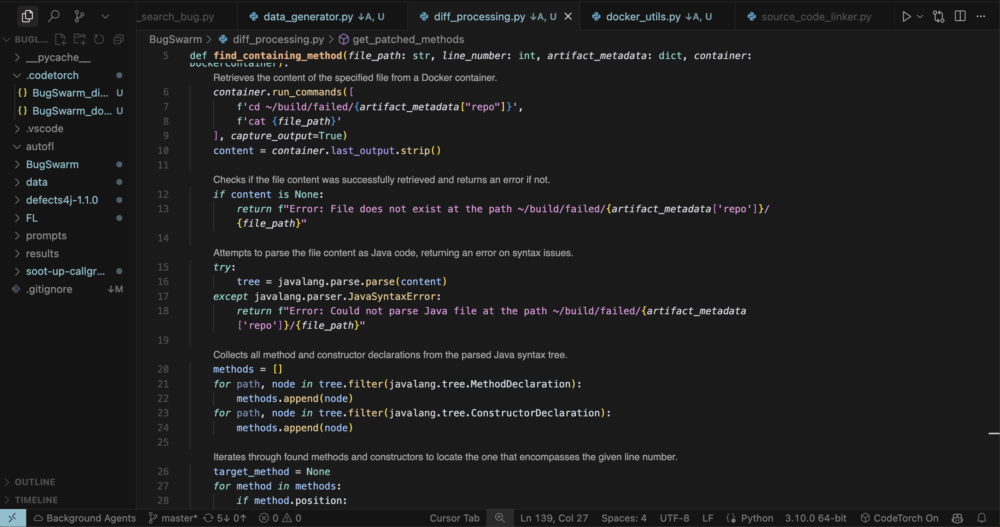

# CodeTorch 

AI-generated natural language outlines help you understand code faster, with less effort, and skim code for easier navigation. 


## Features

**Annotations**: Outlines are rendered as annotations to stay unobtrusive even when outlines are extensive and so your source code isn’t touched.


**Live Documentation**: Outlines update in the background as you save your work.


**Reviewing AI-generated Code**: Outlines overlay AI-generated diffs for easier review.


**Storing Documentation**: Outlines are saved in your project’s root (/.codetorch) and can be pushed to GitHub for re-use by collaborators.


## Requirements

### Setting up a Gemini API Key

CodeTorch uses Gemini-2.0-Flash to generate code summaries. You must configure your Google AI API Key to use the extension: 
1. Open "Preferences: Open User Settings (JSON)": `Cmd/Ctrl + Shift + P`
2. Add the following field to the JSON: `"codetorch.googleApiKey": "your-actual-gemini-api-key-here"`

Need to create an Google AI API key? [Create one](https://aistudio.google.com/app/apikey) in a few clicks and use free credits for the first 90 days (July 2025).

### Setting up outline sytling

Extension creators don't have access to CodeLens annotation styling, so users must manually configure it. Configure them in "Preferences: Open User Settings (JSON)" (`Cmd/Ctrl + Shift + P`). 

Here are recommend styling fields to add:

```
"editor.codeLens": true,
"workbench.colorCustomizations": {
    // For dark color themes
    "editorCodeLens.foreground": "#a7a7a7", 
    // For light color themes
    // "editorCodeLens.foreground": "#666666"
},
"editor.codeLensFontSize": 12,
"editor.codeLensFontFamily": "Helvetica"
```


## Extension Settings

### Triggering outline re-generatoin
By default, oultines are re-generated everytime you save a file. You can alternatively configure a keyboard shortcut to trigger re-generation. 
1. In User Settings (JSON), add `"codetorch.regenerationTrigger": "manual"`
2. In Keyboard Shortcuts, search and configure "Regenerate Summaries"

## References
Thanks to the prior work this project is built on:
1. Shi, Kensen, Deniz Altınbüken, Saswat Anand, Mihai Christodorescu, Katja Grünwedel, Alexa Koenings, Sai Naidu et al. "Natural language outlines for code: Literate programming in the llm era." In Companion Proceedings of the 33rd ACM Symposium on the Foundations of Software Engineering (FSE '25), June 23--27, 2025, Trondheim, Norway
2. Su, C.Y., Bansal, A., Huang, Y., Li, T.J.J. and McMillan, C., 2024. Context-aware Code Summary Generation. arXiv preprint arXiv:2408.09006.
